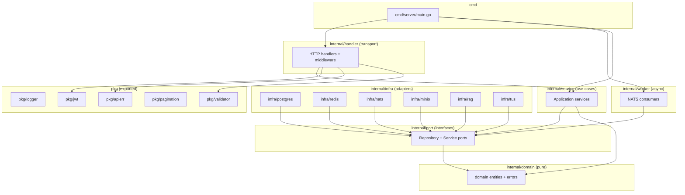

# AeroMentor — Go Backend Implementation Roadmap

> **Single-source implementation guide** for the Go backend (`api/` in `tree.md`).
> Every section maps 1-to-1 with a phase from `wire.md` and references exact
> file paths from `tree.md` so nothing falls through the cracks.

---

## Table of Contents

1. [Technology Stack & Versions](#1-technology-stack--versions)
2. [Phase 1 — Foundation & Shared Libraries](#2-phase-1--foundation--shared-libraries)
3. [Phase 2 — Core Domain Entities](#3-phase-2--core-domain-entities)
4. [Phase 3 — Ports (Interfaces)](#4-phase-3--ports-interfaces)
5. [Phase 4 — Database (Postgres & sqlc)](#5-phase-4--database-postgres--sqlc)
6. [Phase 5 — Infrastructure Adapters](#6-phase-5--infrastructure-adapters)
7. [Phase 6 — Application Services](#7-phase-6--application-services)
8. [Phase 7 — NATS Background Workers](#8-phase-7--nats-background-workers)
9. [Phase 8 — HTTP Transport Layer](#9-phase-8--http-transport-layer)
10. [Phase 9 — Application Entry Point](#10-phase-9--application-entry-point)
11. [Cross-Cutting Concerns](#11-cross-cutting-concerns)
12. [RAG ↔ Go Contract Reference](#12-rag--go-contract-reference)
13. [Verification Plan](#13-verification-plan)
14. [Dependency Graph](#14-dependency-graph)

---

## 1. Technology Stack & Versions

| Concern | Library | Version | Import Path |
|---|---|---|---|
| HTTP Router | chi | v5 | `github.com/go-chi/chi/v5` |
| JWT Auth | golang-jwt | v5 | `github.com/golang-jwt/jwt/v5` |
| DB Driver | pgx | v5 | `github.com/jackc/pgx/v5` |
| SQL Codegen | sqlc | v1.27+ | CLI tool; gen output goes to `internal/infra/postgres/gen/` |
| Migrations | golang-migrate | v4 | `github.com/golang-migrate/migrate/v4` |
| Object Store | minio-go | v7 | `github.com/minio/minio-go/v7` |
| Message Queue | nats.go | v1.50+ | `github.com/nats-io/nats.go` — **new JetStream API** (`github.com/nats-io/nats.go/jetstream`) |
| Cache | go-redis | v9 | `github.com/redis/go-redis/v9` |
| Config | viper | v1 | `github.com/spf13/viper` |
| Logging | zap | v1 | `go.uber.org/zap` |
| Validation | validator | v10 | `github.com/go-playground/validator/v10` |
| Password Hash | bcrypt | stdlib | `golang.org/x/crypto/bcrypt` |
| UUID | google/uuid | v1 | `github.com/google/uuid` |
| Testing | testcontainers-go | latest | `github.com/testcontainers/testcontainers-go` |
| Mocking | mockery | v2 | CLI tool; output → `tests/mock/` |
| TUS Upload | tusd | v2 | `github.com/tus/tusd/v2` |

### Key Best-Practice Decisions

- **New JetStream API**: Use `github.com/nats-io/nats.go/jetstream` (not the legacy `nc.JetStream()` API). The new API uses `jetstream.New(nc)` and provides `Stream`, `Consumer`, `ConsumeContext` with typed errors and automatic heartbeats.
- **sqlc over GORM**: Type-safe, zero-reflection queries. All SQL lives in `.sql` files; Go code is generated.
- **pgx native driver**: Preferred over `database/sql` for connection pooling (`pgxpool`), binary protocol, and `COPY` support.
- **chi v5**: stdlib-compatible, zero-dependency router with built-in middleware ecosystem.
- **Structured logging**: `uber/zap` with `request_id` field injection via middleware.

---

## 2. Phase 1 — Foundation & Shared Libraries

> **Goal**: Establish project scaffold and zero-dependency utility packages.

### 2.1 Project Scaffold

```
backend/
├── go.mod            # module github.com/aeromentor/api; go 1.23
├── go.sum
├── Makefile          # targets: dev, test, lint, migrate-up, migrate-down, sqlc-generate
├── .env.example      # all env vars documented
└── cmd/server/main.go
```

**`go.mod`** — Initialize:
```bash
cd backend && go mod init github.com/aeromentor/api
```

**`Makefile`** targets:

| Target | Command |
|---|---|
| `dev` | `go run ./cmd/server` |
| `test` | `go test ./... -race -count=1` |
| `lint` | `golangci-lint run ./...` |
| `migrate-up` | `migrate -path internal/infra/postgres/migrations -database "$DATABASE_URL" up` |
| `migrate-down` | `migrate -path internal/infra/postgres/migrations -database "$DATABASE_URL" down 1` |
| `sqlc` | `cd internal/infra/postgres && sqlc generate` |
| `mock` | `mockery --all --dir=internal/port --output=tests/mock --outpkg=mock` |

### 2.2 `pkg/logger/logger.go`

```go
// Thin wrapper around uber/zap.
// - NewLogger(level string) → *zap.Logger
// - Injects fields: request_id, user_id, timestamp
// - Production: JSON encoder. Development: console encoder.
```

**Design**:
- Export `func NewLogger(level string) *zap.Logger` and `func With(ctx context.Context, l *zap.Logger) *zap.Logger`.
- Store logger in `context.Context` via a context key; retrieve with `logger.FromCtx(ctx)`.

### 2.3 `pkg/apierr/apierr.go`

```go
// Typed API error with JSON serialization.
// Wraps an HTTP status code, a machine-readable code string, and a human message.
type APIError struct {
    Status  int    `json:"-"`
    Code    string `json:"code"`
    Message string `json:"message"`
}

func (e *APIError) Error() string { return e.Message }

// Constructors:
// BadRequest(msg), NotFound(msg), Unauthorized(msg), Forbidden(msg), Internal(msg)

// WriteJSON(w http.ResponseWriter, err error):
//   If err is *APIError → marshal and write. Otherwise → 500 Internal.
```

### 2.4 `pkg/pagination/pagination.go`

```go
// Cursor-based pagination helpers.
// - ParseCursor(r *http.Request) → (cursor string, limit int)
// - EncodeCursor(id uuid.UUID) → string (base64)
// - Response envelope:
type Page[T any] struct {
    Items      []T    `json:"items"`
    NextCursor string `json:"next_cursor,omitempty"`
    HasMore    bool   `json:"has_more"`
}
```

### 2.5 `pkg/validator/validator.go`

```go
// Shared input validation. Uses go-playground/validator.
// - var Validate *validator.Validate (singleton, registered custom rules)
// - Custom tags: "rank" (valid Indian Air Force ranks), "role" (student|instructor)
// - func ValidateStruct(s any) error → returns *APIError with field-level details
```

### 2.6 `pkg/jwt/jwt.go`

```go
// JWT token generation and validation using golang-jwt/v5.
// - Uses HMAC-SHA256 (HS256) signing with a configurable secret.
// - Claims struct:
type Claims struct {
    jwt.RegisteredClaims
    UserID string `json:"user_id"`
    Role   string `json:"role"`    // "student" | "instructor"
    Rank   string `json:"rank"`
}

// - GenerateAccessToken(userID, role, rank string, secret string, ttl time.Duration) (string, error)
// - GenerateRefreshToken(userID string, secret string, ttl time.Duration) (string, error)
// - ValidateToken(tokenStr, secret string) (*Claims, error) — checks exp, iat, iss
```

**Best Practices (golang-jwt/v5)**:
- Always use `jwt.WithValidMethods([]string{"HS256"})` in parser options.
- Set `Issuer` to `"aeromentor"` and validate it.
- Access token TTL: 15 minutes. Refresh token TTL: 7 days.

### 2.7 `internal/config/config.go`

```go
// Viper-based configuration struct. All values sourced from env vars / config.yaml.
type Config struct {
    Server   ServerConfig
    DB       DBConfig
    Redis    RedisConfig
    NATS     NATSConfig
    MinIO    MinIOConfig
    RAG      RAGConfig
    JWT      JWTConfig
    Log      LogConfig
}

type ServerConfig struct {
    Host         string        `mapstructure:"SERVER_HOST"`
    Port         int           `mapstructure:"SERVER_PORT"`
    ReadTimeout  time.Duration `mapstructure:"SERVER_READ_TIMEOUT"`
    WriteTimeout time.Duration `mapstructure:"SERVER_WRITE_TIMEOUT"`
}

type DBConfig struct {
    DSN             string `mapstructure:"DATABASE_URL"`
    MaxOpenConns    int    `mapstructure:"DB_MAX_OPEN_CONNS"`
    MaxIdleConns    int    `mapstructure:"DB_MAX_IDLE_CONNS"`
    ConnMaxLifetime time.Duration `mapstructure:"DB_CONN_MAX_LIFETIME"`
}

type NATSConfig struct {
    URL      string `mapstructure:"NATS_URL"`
    User     string `mapstructure:"NATS_USER"`
    Password string `mapstructure:"NATS_PASSWORD"`
}

type MinIOConfig struct {
    Endpoint  string `mapstructure:"MINIO_ENDPOINT"`
    AccessKey string `mapstructure:"MINIO_ACCESS_KEY"`
    SecretKey string `mapstructure:"MINIO_SECRET_KEY"`
    UseSSL    bool   `mapstructure:"MINIO_USE_SSL"`
    Bucket    string `mapstructure:"MINIO_BUCKET"`
}

type RAGConfig struct {
    BaseURL       string `mapstructure:"RAG_BASE_URL"`   // http://rag:8000
    InternalToken string `mapstructure:"RAG_INTERNAL_TOKEN"`
}

type JWTConfig struct {
    AccessSecret  string        `mapstructure:"JWT_ACCESS_SECRET"`
    RefreshSecret string        `mapstructure:"JWT_REFRESH_SECRET"`
    AccessTTL     time.Duration `mapstructure:"JWT_ACCESS_TTL"`
    RefreshTTL    time.Duration `mapstructure:"JWT_REFRESH_TTL"`
}
```

**`internal/config/config.yaml`** — Sensible defaults for local development.

---

## 3. Phase 2 — Core Domain Entities

> **Goal**: Pure domain types in `internal/domain/` — **zero imports from infra packages**.

### 3.1 `internal/domain/user.go`

```go
type Role string
const (
    RoleStudent    Role = "student"
    RoleInstructor Role = "instructor"
)

type User struct {
    ID           uuid.UUID
    Name         string
    EnrollmentID string
    Rank         string
    Batch        string
    Role         Role
    PasswordHash string
    CreatedAt    time.Time
    UpdatedAt    time.Time
}
```

### 3.2 `internal/domain/course.go`

```go
type Course struct {
    ID           uuid.UUID
    Title        string
    Description  string
    Rank         string    // e.g. "Flying Officer", "Flight Lieutenant"
    InstructorID uuid.UUID
    CreatedAt    time.Time
    UpdatedAt    time.Time
}
```

### 3.3 `internal/domain/file.go`

```go
type IngestStatus string
const (
    IngestPending    IngestStatus = "pending"
    IngestProcessing IngestStatus = "processing"
    IngestReady      IngestStatus = "ready"
    IngestFailed     IngestStatus = "failed"
)

type FileAsset struct {
    ID           uuid.UUID
    CourseID     uuid.UUID
    FileName     string
    MinioKey     string
    IngestStatus IngestStatus
    CreatedAt    time.Time
    UpdatedAt    time.Time
}
```

### 3.4 `internal/domain/quiz.go`

```go
type QuizStatus string
const (
    QuizPending    QuizStatus = "pending"
    QuizGenerating QuizStatus = "generating"
    QuizReady      QuizStatus = "ready"
    QuizFailed     QuizStatus = "failed"
)

type Difficulty string
const (
    DifficultyEasy   Difficulty = "easy"
    DifficultyMedium Difficulty = "medium"
    DifficultyHard   Difficulty = "hard"
)

type Quiz struct {
    ID         uuid.UUID
    CourseID   uuid.UUID
    Difficulty Difficulty
    Status     QuizStatus
    CreatedAt  time.Time
    UpdatedAt  time.Time
}

type QuestionType string
const (
    QuestionMCQ       QuestionType = "mcq"
    QuestionOpenEnded QuestionType = "open_ended"
)

type Choice struct {
    Label string  // "A", "B", "C", "D"
    Text  string
}

type Question struct {
    ID       uuid.UUID
    QuizID   uuid.UUID
    Type     QuestionType
    Question string
    Choices  []Choice   // nil for open_ended
    Answer   string
    OrderIdx int
}

type Attempt struct {
    ID        uuid.UUID
    QuizID    uuid.UUID
    UserID    uuid.UUID
    Score     float64
    Total     int
    StartedAt time.Time
    EndedAt   *time.Time
}

type Answer struct {
    ID         uuid.UUID
    AttemptID  uuid.UUID
    QuestionID uuid.UUID
    UserAnswer string
    IsCorrect  bool
}
```

### 3.5 `internal/domain/chat.go`

```go
type ChatSession struct {
    ID        uuid.UUID
    UserID    uuid.UUID
    CourseID  *uuid.UUID  // nil = cross-course
    Title     string
    CreatedAt time.Time
    UpdatedAt time.Time
}

type MessageRole string
const (
    RoleUser      MessageRole = "user"
    RoleAssistant MessageRole = "assistant"
)

type Citation struct {
    FileName string
    FileID   string
    Score    *float64
}

type Message struct {
    ID        uuid.UUID
    SessionID uuid.UUID
    Role      MessageRole
    Content   string
    Citations []Citation  // stored as JSONB
    CreatedAt time.Time
}
```

### 3.6 `internal/domain/analytics.go`

```go
type EventType string
// e.g. "quiz_attempt", "chat_message", "file_view", "course_enroll"

type Event struct {
    ID        uuid.UUID
    UserID    uuid.UUID
    CourseID  *uuid.UUID
    Type      EventType
    Metadata  map[string]any  // JSONB
    CreatedAt time.Time
}

type Metric struct {
    CourseID       uuid.UUID
    TotalStudents  int
    AvgQuizScore   float64
    TotalMessages  int
    TotalFiles     int
}
```

### 3.7 `internal/domain/errors.go`

```go
// Sentinel domain errors — handlers map these to HTTP status codes.
var (
    ErrNotFound       = errors.New("not found")
    ErrUnauthorized   = errors.New("unauthorized")
    ErrForbidden      = errors.New("forbidden")
    ErrConflict       = errors.New("conflict")
    ErrBadInput       = errors.New("bad input")
    ErrInternal       = errors.New("internal error")
)
```

---

## 4. Phase 3 — Ports (Interfaces)

> **Goal**: Define contracts in `internal/port/` — only Go interfaces, no implementations.

### 4.1 Repository Ports

```
internal/port/
├── user_repo.go       → UserRepository
├── course_repo.go     → CourseRepository (includes ListByRank)
├── file_repo.go       → FileRepository (includes UpdateIngestStatus, ListByCourse, AllReadyForCourse)
├── quiz_repo.go       → QuizRepository (CRUD + attempts + answers + questions)
├── chat_repo.go       → ChatRepository (sessions + messages)
└── analytics_repo.go  → AnalyticsRepository (record event, aggregate metrics)
```

**Example** — `port/file_repo.go`:
```go
type FileRepository interface {
    Create(ctx context.Context, file *domain.FileAsset) error
    GetByID(ctx context.Context, id uuid.UUID) (*domain.FileAsset, error)
    ListByCourse(ctx context.Context, courseID uuid.UUID) ([]domain.FileAsset, error)
    UpdateIngestStatus(ctx context.Context, fileID uuid.UUID, status domain.IngestStatus) error
    AllReadyForCourse(ctx context.Context, courseID uuid.UUID) (bool, error) // Check if all files are ingested
}
```

### 4.2 External Service Ports

```
internal/port/
├── storage.go     → ObjectStorage (PresignUpload, PresignView, Delete)
├── cache.go       → Cache (Get, Set, Delete, Exists) — generic string-based
├── queue.go       → MessageQueue (Publish)
└── rag.go         → RAGClient (Chat only — ingest/quiz go through NATS)
```

**`port/rag.go`** — per `wire.md` wiring gotcha:
```go
// RAGClient only wraps synchronous HTTP calls.
// Ingest and Quiz generation happen asynchronously via NATS.
type RAGClient interface {
    // ChatStream sends a query to the RAG engine and returns an SSE reader.
    // Go resolves course_ids from Postgres BEFORE calling this.
    ChatStream(ctx context.Context, req ChatRequest) (io.ReadCloser, error)
    // Chat sends a non-streaming query and returns the full response.
    Chat(ctx context.Context, req ChatRequest) (*ChatResponse, error)
}

type ChatRequest struct {
    CourseIDs []string       `json:"course_ids"`
    Query     string         `json:"query"`
    Stream    bool           `json:"stream"`
    History   []ChatMessage  `json:"history"`
}

type ChatMessage struct {
    Role    string `json:"role"`
    Content string `json:"content"`
}

type ChatResponse struct {
    Answer    string         `json:"answer"`
    Citations []CitationItem `json:"citations"`
}

type CitationItem struct {
    FileName string   `json:"file_name"`
    FileID   string   `json:"file_id"`
    Score    *float64 `json:"score,omitempty"`
}
```

**`port/queue.go`**:
```go
type MessageQueue interface {
    Publish(ctx context.Context, subject string, data []byte) error
}
```

---

## 5. Phase 4 — Database (Postgres & sqlc)

> **Goal**: Schema migrations + SQL queries + sqlc code generation.

### 5.1 Migrations (`internal/infra/postgres/migrations/`)

Use `golang-migrate` format: `{version}_{name}.up.sql` / `{version}_{name}.down.sql`.

#### `00001_users.up.sql`

```sql
CREATE EXTENSION IF NOT EXISTS "pgcrypto";

CREATE TABLE users (
    id             UUID PRIMARY KEY DEFAULT gen_random_uuid(),
    name           TEXT NOT NULL,
    enrollment_id  TEXT NOT NULL UNIQUE,
    rank           TEXT NOT NULL,
    batch          TEXT NOT NULL,
    role           TEXT NOT NULL CHECK (role IN ('student', 'instructor')),
    password_hash  TEXT NOT NULL,
    created_at     TIMESTAMPTZ NOT NULL DEFAULT now(),
    updated_at     TIMESTAMPTZ NOT NULL DEFAULT now()
);

CREATE INDEX idx_users_enrollment_id ON users(enrollment_id);
CREATE INDEX idx_users_role ON users(role);
```

#### `00002_courses.up.sql`

```sql
CREATE TABLE courses (
    id             UUID PRIMARY KEY DEFAULT gen_random_uuid(),
    title          TEXT NOT NULL,
    description    TEXT NOT NULL DEFAULT '',
    rank           TEXT NOT NULL,
    instructor_id  UUID NOT NULL REFERENCES users(id) ON DELETE CASCADE,
    created_at     TIMESTAMPTZ NOT NULL DEFAULT now(),
    updated_at     TIMESTAMPTZ NOT NULL DEFAULT now()
);

CREATE INDEX idx_courses_rank ON courses(rank);
CREATE INDEX idx_courses_instructor ON courses(instructor_id);
```

#### `00003_files.up.sql`

```sql
CREATE TABLE files (
    id             UUID PRIMARY KEY DEFAULT gen_random_uuid(),
    course_id      UUID NOT NULL REFERENCES courses(id) ON DELETE CASCADE,
    file_name      TEXT NOT NULL,
    minio_key      TEXT NOT NULL,
    ingest_status  TEXT NOT NULL DEFAULT 'pending'
                   CHECK (ingest_status IN ('pending', 'processing', 'ready', 'failed')),
    created_at     TIMESTAMPTZ NOT NULL DEFAULT now(),
    updated_at     TIMESTAMPTZ NOT NULL DEFAULT now()
);

CREATE INDEX idx_files_course ON files(course_id);
CREATE INDEX idx_files_status ON files(ingest_status);
```

#### `00004_quizzes.up.sql`

```sql
CREATE TABLE quizzes (
    id          UUID PRIMARY KEY DEFAULT gen_random_uuid(),
    course_id   UUID NOT NULL REFERENCES courses(id) ON DELETE CASCADE,
    difficulty  TEXT NOT NULL CHECK (difficulty IN ('easy', 'medium', 'hard')),
    status      TEXT NOT NULL DEFAULT 'pending'
                CHECK (status IN ('pending', 'generating', 'ready', 'failed')),
    created_at  TIMESTAMPTZ NOT NULL DEFAULT now(),
    updated_at  TIMESTAMPTZ NOT NULL DEFAULT now(),
    UNIQUE(course_id, difficulty)
);

CREATE TABLE questions (
    id        UUID PRIMARY KEY DEFAULT gen_random_uuid(),
    quiz_id   UUID NOT NULL REFERENCES quizzes(id) ON DELETE CASCADE,
    type      TEXT NOT NULL CHECK (type IN ('mcq', 'open_ended')),
    question  TEXT NOT NULL,
    choices   JSONB,           -- null for open_ended; [{label, text}, ...]
    answer    TEXT NOT NULL,
    order_idx INT NOT NULL DEFAULT 0
);

CREATE TABLE attempts (
    id         UUID PRIMARY KEY DEFAULT gen_random_uuid(),
    quiz_id    UUID NOT NULL REFERENCES quizzes(id) ON DELETE CASCADE,
    user_id    UUID NOT NULL REFERENCES users(id) ON DELETE CASCADE,
    score      DOUBLE PRECISION NOT NULL DEFAULT 0,
    total      INT NOT NULL DEFAULT 0,
    started_at TIMESTAMPTZ NOT NULL DEFAULT now(),
    ended_at   TIMESTAMPTZ
);

CREATE TABLE answers (
    id          UUID PRIMARY KEY DEFAULT gen_random_uuid(),
    attempt_id  UUID NOT NULL REFERENCES attempts(id) ON DELETE CASCADE,
    question_id UUID NOT NULL REFERENCES questions(id) ON DELETE CASCADE,
    user_answer TEXT NOT NULL,
    is_correct  BOOLEAN NOT NULL DEFAULT false
);
```

#### `00005_chat.up.sql`

```sql
CREATE TABLE chat_sessions (
    id         UUID PRIMARY KEY DEFAULT gen_random_uuid(),
    user_id    UUID NOT NULL REFERENCES users(id) ON DELETE CASCADE,
    course_id  UUID REFERENCES courses(id) ON DELETE SET NULL,  -- null = cross-course
    title      TEXT NOT NULL DEFAULT 'New Chat',
    created_at TIMESTAMPTZ NOT NULL DEFAULT now(),
    updated_at TIMESTAMPTZ NOT NULL DEFAULT now()
);

CREATE INDEX idx_chat_sessions_user ON chat_sessions(user_id);

CREATE TABLE chat_messages (
    id         UUID PRIMARY KEY DEFAULT gen_random_uuid(),
    session_id UUID NOT NULL REFERENCES chat_sessions(id) ON DELETE CASCADE,
    role       TEXT NOT NULL CHECK (role IN ('user', 'assistant')),
    content    TEXT NOT NULL,
    citations  JSONB DEFAULT '[]',   -- [{file_name, file_id, score}, ...]
    created_at TIMESTAMPTZ NOT NULL DEFAULT now()
);

CREATE INDEX idx_chat_messages_session ON chat_messages(session_id);
```

#### `00006_analytics.up.sql`

```sql
CREATE TABLE events (
    id         UUID PRIMARY KEY DEFAULT gen_random_uuid(),
    user_id    UUID NOT NULL REFERENCES users(id) ON DELETE CASCADE,
    course_id  UUID REFERENCES courses(id) ON DELETE SET NULL,
    type       TEXT NOT NULL,
    metadata   JSONB DEFAULT '{}',
    created_at TIMESTAMPTZ NOT NULL DEFAULT now()
);

CREATE INDEX idx_events_user ON events(user_id);
CREATE INDEX idx_events_course ON events(course_id);
CREATE INDEX idx_events_type ON events(type);
```

### 5.2 SQL Queries (`internal/infra/postgres/query/`)

Write queries using sqlc annotations (`-- name:`, `:one`, `:many`, `:exec`, `:execresult`).

**Example** — `query/users.sql`:
```sql
-- name: CreateUser :one
INSERT INTO users (name, enrollment_id, rank, batch, role, password_hash)
VALUES ($1, $2, $3, $4, $5, $6)
RETURNING *;

-- name: GetUserByID :one
SELECT * FROM users WHERE id = $1;

-- name: GetUserByEnrollmentID :one
SELECT * FROM users WHERE enrollment_id = $1;
```

**Example** — `query/courses.sql`:
```sql
-- name: CreateCourse :one
INSERT INTO courses (title, description, rank, instructor_id)
VALUES ($1, $2, $3, $4) RETURNING *;

-- name: ListCoursesByRank :many
SELECT * FROM courses WHERE rank = $1
ORDER BY created_at DESC;

-- name: ListCoursesByInstructor :many
SELECT * FROM courses WHERE instructor_id = $1
ORDER BY created_at DESC;

-- name: GetCourseByID :one
SELECT * FROM courses WHERE id = $1;
```

**Example** — `query/files.sql`:
```sql
-- name: CreateFile :one
INSERT INTO files (course_id, file_name, minio_key, ingest_status)
VALUES ($1, $2, $3, $4) RETURNING *;

-- name: UpdateFileIngestStatus :exec
UPDATE files SET ingest_status = $2, updated_at = now() WHERE id = $1;

-- name: ListFilesByCourse :many
SELECT * FROM files WHERE course_id = $1 ORDER BY created_at DESC;

-- name: AllFilesReadyForCourse :one
SELECT NOT EXISTS (
    SELECT 1 FROM files WHERE course_id = $1 AND ingest_status != 'ready'
) AS all_ready;

-- name: GetFileByID :one
SELECT * FROM files WHERE id = $1;
```

### 5.3 `sqlc.yaml` Configuration

```yaml
version: "2"
sql:
  - engine: "postgresql"
    queries: "query/"
    schema: "migrations/"
    gen:
      go:
        package: "gen"
        out: "gen"
        sql_package: "pgx/v5"
        emit_json_tags: true
        emit_prepared_queries: false
        emit_interface: true
        emit_exact_table_names: false
        overrides:
          - db_type: "uuid"
            go_type: "github.com/google/uuid.UUID"
          - db_type: "timestamptz"
            go_type: "time.Time"
```

### 5.4 Repository Adapters (`internal/infra/postgres/`)

Each file wraps the sqlc-generated `gen/` code and satisfies a `port/` interface.

**Pattern**:
```go
// internal/infra/postgres/user_repo.go
type userRepo struct {
    q *gen.Queries
}

func NewUserRepo(pool *pgxpool.Pool) port.UserRepository {
    return &userRepo{q: gen.New(pool)}
}

func (r *userRepo) Create(ctx context.Context, u *domain.User) error {
    row, err := r.q.CreateUser(ctx, gen.CreateUserParams{
        Name:         u.Name,
        EnrollmentID: u.EnrollmentID,
        Rank:         u.Rank,
        Batch:        u.Batch,
        Role:         string(u.Role),
        PasswordHash: u.PasswordHash,
    })
    if err != nil { return err }
    u.ID = row.ID
    u.CreatedAt = row.CreatedAt
    return nil
}
```

---

## 6. Phase 5 — Infrastructure Adapters

> **Goal**: Implement all external-service ports.

### 6.1 NATS JetStream (`internal/infra/nats/`)

> [!IMPORTANT]
> Use the **new JetStream API** (`github.com/nats-io/nats.go/jetstream`), NOT the legacy `nc.JetStream()`.

#### `client.go` — Connection & Stream Setup

```go
// Connect to NATS, create JetStream context, ensure streams exist.
func NewJetStream(cfg config.NATSConfig) (jetstream.JetStream, *nats.Conn, error) {
    nc, err := nats.Connect(cfg.URL, nats.UserInfo(cfg.User, cfg.Password))
    js, err := jetstream.New(nc)
    // Ensure streams...
    return js, nc, nil
}
```

**Streams to create** (must match Python exactly):

| Stream Name | Subjects | Retention | Notes |
|---|---|---|---|
| `RAG_INGEST` | `rag.ingest.request` | `WorkQueuePolicy` | Go publishes, Python consumes |
| `RAG_INGEST_DONE` | `rag.ingest.done` | `LimitsPolicy` (max_age: 1h) | Python publishes, Go consumes |
| `RAG_QUIZ` | `quiz.generate.>` | `WorkQueuePolicy` | Go publishes, Python consumes |
| `RAG_QUIZ_DONE` | `quiz.generate.done` | `LimitsPolicy` (max_age: 1h) | Python publishes, Go consumes |

#### `subjects.go` — Subject Constants

```go
// Must mirror rag/app/messaging/subjects.py EXACTLY.
const (
    StreamIngest     = "RAG_INGEST"
    StreamIngestDone = "RAG_INGEST_DONE"
    StreamQuiz       = "RAG_QUIZ"
    StreamQuizDone   = "RAG_QUIZ_DONE"

    SubjectIngestRequest = "rag.ingest.request"
    SubjectIngestDone    = "rag.ingest.done"
    SubjectQuizRequest   = "quiz.generate.request"
    SubjectQuizDone      = "quiz.generate.done"

    DurableIngestDone = "go-ingest-done"
    DurableQuizDone   = "go-quiz-done"
)
```

#### `publisher.go` — Implements `port.MessageQueue`

```go
type publisher struct { js jetstream.JetStream }

func (p *publisher) Publish(ctx context.Context, subject string, data []byte) error {
    _, err := p.js.Publish(ctx, subject, data)
    return err
}
```

#### `subscriber.go` — Pull Consumer Helpers

```go
// CreateConsumer wraps jetstream consumer creation with durable name and filter.
// ConsumeLoop starts a blocking consume loop with message handler callback.
func ConsumeLoop(ctx context.Context, cons jetstream.Consumer, handler func(msg jetstream.Msg)) error {
    cc, err := cons.Consume(func(msg jetstream.Msg) {
        handler(msg)
    })
    <-ctx.Done()
    cc.Stop()
    return nil
}
```

> [!WARNING]
> **NATS Payload Contract**: Go struct JSON tags must match Python's snake_case field names exactly. The ingest request payload must include: `bucket`, `key`, `course_id`, `file_id`, `file_name`, `teacher_id`.

### 6.2 RAG HTTP Client (`internal/infra/rag/client.go`)

```go
// Implements port.RAGClient — only /api/v1/chat endpoint.
type ragClient struct {
    baseURL string
    token   string
    http    *http.Client
}

func (c *ragClient) ChatStream(ctx context.Context, req port.ChatRequest) (io.ReadCloser, error) {
    // POST to http://<rag>/api/v1/chat with stream=true
    // Set header X-Internal-Token
    // Return response.Body as io.ReadCloser (SSE stream)
}

func (c *ragClient) Chat(ctx context.Context, req port.ChatRequest) (*port.ChatResponse, error) {
    // POST to http://<rag>/api/v1/chat with stream=false
    // Parse JSON response
}
```

> [!IMPORTANT]
> Go must set `X-Internal-Token` header matching `RAG_INTERNAL_TOKEN` env var. The Python `deps.py` validates this.

### 6.3 Object Storage (`internal/infra/minio/`)

#### `client.go`

```go
func NewMinIOClient(cfg config.MinIOConfig) (*minio.Client, error) {
    return minio.New(cfg.Endpoint, &minio.Options{
        Creds:  credentials.NewStaticV4(cfg.AccessKey, cfg.SecretKey, ""),
        Secure: cfg.UseSSL,
    })
}
```

#### `storage.go` — Implements `port.ObjectStorage`

```go
type storage struct {
    client *minio.Client
    bucket string
}

// PresignUpload generates a presigned PUT URL for frontend uploads.
func (s *storage) PresignUpload(ctx context.Context, key string, expiry time.Duration) (string, error) {
    url, err := s.client.PresignedPutObject(ctx, s.bucket, key, expiry)
    return url.String(), err
}

// PresignView generates a presigned GET URL for students to view PDFs.
func (s *storage) PresignView(ctx context.Context, key string, expiry time.Duration) (string, error) {
    url, err := s.client.PresignedGetObject(ctx, s.bucket, key, expiry, nil)
    return url.String(), err
}
```

### 6.4 Redis Cache (`internal/infra/redis/`)

#### `client.go`

```go
func NewRedisClient(cfg config.RedisConfig) *redis.Client {
    return redis.NewClient(&redis.Options{
        Addr:     cfg.Addr,
        Password: cfg.Password,
        DB:       cfg.DB,
    })
}
```

#### `cache.go` — Implements `port.Cache`

```go
type cache struct { rdb *redis.Client }

func (c *cache) Get(ctx context.Context, key string) (string, error)
func (c *cache) Set(ctx context.Context, key, val string, ttl time.Duration) error
func (c *cache) Delete(ctx context.Context, key string) error
```

#### `ratelimit.go` — Token Bucket Rate Limiter

```go
// Uses Redis MULTI/EXEC for atomic token bucket.
// Key pattern: "rl:<user_id>" with configurable rate and burst.
func (c *cache) AllowRequest(ctx context.Context, key string, rate, burst int) (bool, error)
```

### 6.5 TUS Upload Handler (`internal/infra/tus/handler.go`)

```go
// Uses tusd/v2 with S3 (MinIO) storage backend.
// Post-finish hook:
//   1. Creates FileAsset record in Postgres (status=pending)
//   2. Publishes to rag.ingest.request via NATS with:
//      { bucket, key, course_id, file_id, file_name, teacher_id }
```

---

## 7. Phase 6 — Application Services

> **Goal**: Business logic orchestration in `internal/service/`.

### 7.1 `user_service.go`

```
- Register(name, enrollmentID, rank, batch, password, role) → User, error
    - Hash password with bcrypt (cost=12)
    - Check enrollment_id uniqueness
    - Insert via UserRepository
- Login(enrollmentID, password) → { accessToken, refreshToken }, error
    - Fetch user by enrollment_id
    - Compare bcrypt hash
    - Generate JWT pair
- RefreshToken(refreshToken) → { accessToken }, error
- GetProfile(userID) → User, error
```

### 7.2 `course_service.go`

```
- Create(title, desc, rank, instructorID) → Course, error
- GetByID(courseID) → Course, error
- ListByRank(rank) → []Course, error        // students see courses matching their rank
- ListByInstructor(instructorID) → []Course  // instructors see their own courses
- Update(courseID, instructorID, updates) → Course, error  // ownership check
- Delete(courseID, instructorID) → error
```

### 7.3 `file_service.go`

```
- InitUpload(courseID, fileName, instructorID) → { uploadURL, fileID }, error
    1. Create FileAsset in DB (status=pending)
    2. Generate MinIO presigned PUT URL
    3. Return both to frontend
- ConfirmUpload(fileID, instructorID) → error
    1. Verify file ownership
    2. Publish NATS message to rag.ingest.request:
       { bucket, key, course_id, file_id, file_name, teacher_id }
    3. Update status → "processing"
- GetIngestStatus(fileID) → IngestStatus
- GetViewURL(fileID, userID) → string
    1. Check user has access to the course
    2. Generate MinIO presigned GET URL
- ListByCourse(courseID) → []FileAsset
```

### 7.4 `chat_service.go`

> [!IMPORTANT]
> Per `wire.md`: Go must resolve the user's authorized `course_ids` from Postgres **before** calling the RAG chat API. The Python engine is stateless.

```
- CreateSession(userID, courseID?) → ChatSession
- ListSessions(userID) → []ChatSession
- SendMessage(sessionID, userID, query) → SSE stream / ChatResponse
    1. Fetch session from DB
    2. Fetch user's authorized course_ids:
       - If session.CourseID is set → [session.CourseID]
       - Else → all courses matching user's Rank
    3. Fetch last N messages from DB (history for condenser)
    4. Save user message to DB
    5. Call RAGClient.ChatStream() / Chat() passing course_ids + history + query
    6. Save assistant response + citations to DB
    7. Return stream / response to handler
- GetHistory(sessionID) → []Message
```

### 7.5 `quiz_service.go`

```
- ListByCourse(courseID) → []Quiz            // 3 quizzes: easy, medium, hard
- GetQuiz(quizID) → Quiz + []Question
- StartAttempt(quizID, userID) → Attempt
- SubmitAnswer(attemptID, questionID, userAnswer) → Answer (with is_correct)
- FinishAttempt(attemptID) → Attempt (with final score)
- ResetQuiz(quizID, instructorID) → error
    1. Verify instructor owns the course
    2. Delete existing questions
    3. Set status → "generating"
    4. Publish to quiz.generate.request: { course_id, difficulty }
- GetResults(attemptID, userID) → Attempt + []Answer
```

### 7.6 `analytics_service.go`

```
- RecordEvent(userID, courseID?, type, metadata)
- GetCourseMetrics(courseID) → Metric
- GetStudentScores(courseID) → []{ userID, name, rank, avgScore }
- GetOverview(instructorID) → { totalStudents, totalCourses, avgScore }
```

---

## 8. Phase 7 — NATS Background Workers

> **Goal**: Go consumers listening for results from the Python RAG engine.

### 8.1 `internal/worker/ingest_done_worker.go`

**Subscribes to**: `rag.ingest.done` (stream `RAG_INGEST_DONE`)

**Payload from Python** (on success):
```json
{
  "status": "success",
  "file_id": "uuid-string",
  "course_id": "uuid-string",
  "chunks_stored": 42
}
```

**Payload from Python** (on failure):
```json
{
  "status": "failed",
  "file_id": "uuid-string"
}
```

**Logic**:
1. Parse JSON payload.
2. Update `files.ingest_status` → `"ready"` or `"failed"`.
3. **Critical**: Check if ALL files for this `course_id` are now `"ready"`.
4. If all ready → publish **exactly 3 messages** to `quiz.generate.request`:
   ```json
   {"course_id": "...", "difficulty": "easy",   "limit_chunks": 20}
   {"course_id": "...", "difficulty": "medium",  "limit_chunks": 20}
   {"course_id": "...", "difficulty": "hard",    "limit_chunks": 20}
   ```
5. Create Quiz records in DB for each difficulty with status `"generating"`.
6. On any DB error → `msg.Nak()` to trigger redelivery.

### 8.2 `internal/worker/quiz_done_worker.go`

**Subscribes to**: `quiz.generate.done` (stream `RAG_QUIZ_DONE`)

**Payload from Python** (on success):
```json
{
  "status": "success",
  "course_id": "uuid-string",
  "difficulty": "medium",
  "questions": [
    {
      "type": "mcq",
      "question": "What is...?",
      "choices": [{"label": "A", "text": "..."}, ...],
      "answer": "A"
    },
    {
      "type": "open_ended",
      "question": "Explain...",
      "choices": null,
      "answer": "..."
    }
  ]
}
```

**Logic**:
1. Parse JSON payload.
2. Find or create Quiz record for `(course_id, difficulty)`.
3. Delete any existing questions for this quiz (idempotent reset).
4. Bulk-insert all `questions` into the `questions` table.
5. Update quiz status → `"ready"` (or `"failed"` if status is `"failed"`).
6. On DB error → `msg.Nak()`.

### 8.3 `internal/worker/quiz_worker.go` (Optional)

A manual re-trigger helper that can be called from the quiz handler to re-publish `quiz.generate.request`.

---

## 9. Phase 8 — HTTP Transport Layer

> **Goal**: Expose services to the Next.js frontend via RESTful API.

### 9.1 `internal/handler/router.go`

```go
func NewRouter(
    userH    *UserHandler,
    courseH  *CourseHandler,
    fileH    *FileHandler,
    quizH    *QuizHandler,
    chatH    *ChatHandler,
    analytH  *AnalyticsHandler,
    healthH  *HealthHandler,
    cfg      *config.Config,
) *chi.Mux {
    r := chi.NewRouter()

    // Global middleware
    r.Use(middleware.RequestID)
    r.Use(middleware.RealIP)
    r.Use(RequestLogger(cfg))            // custom: injects zap logger
    r.Use(middleware.Recoverer)
    r.Use(middleware.Timeout(30 * time.Second))
    r.Use(CORSMiddleware(cfg))

    // Public routes
    r.Get("/health", healthH.Health)
    r.Post("/api/v1/auth/register", userH.Register)
    r.Post("/api/v1/auth/login", userH.Login)
    r.Post("/api/v1/auth/refresh", userH.RefreshToken)

    // Authenticated routes
    r.Group(func(r chi.Router) {
        r.Use(JWTAuthMiddleware(cfg.JWT.AccessSecret))

        // User
        r.Get("/api/v1/users/me", userH.Me)

        // Courses
        r.Get("/api/v1/courses", courseH.List)
        r.Get("/api/v1/courses/{courseId}", courseH.Get)

        // Instructor-only
        r.Group(func(r chi.Router) {
            r.Use(RBACMiddleware(domain.RoleInstructor))
            r.Post("/api/v1/courses", courseH.Create)
            r.Put("/api/v1/courses/{courseId}", courseH.Update)
            r.Delete("/api/v1/courses/{courseId}", courseH.Delete)
            r.Post("/api/v1/courses/{courseId}/files/upload", fileH.InitUpload)
            r.Post("/api/v1/files/{fileId}/confirm", fileH.ConfirmUpload)
            r.Post("/api/v1/quizzes/{quizId}/reset", quizH.Reset)

            // Analytics
            r.Get("/api/v1/analytics", analytH.Overview)
            r.Get("/api/v1/analytics/{courseId}", analytH.CourseMetrics)
        })

        // Files (student + instructor)
        r.Get("/api/v1/courses/{courseId}/files", fileH.ListByCourse)
        r.Get("/api/v1/files/{fileId}/status", fileH.IngestStatus)
        r.Get("/api/v1/files/{fileId}/view", fileH.ViewURL)

        // Quizzes
        r.Get("/api/v1/courses/{courseId}/quizzes", quizH.ListByCourse)
        r.Get("/api/v1/quizzes/{quizId}", quizH.Get)
        r.Post("/api/v1/quizzes/{quizId}/attempt", quizH.StartAttempt)
        r.Post("/api/v1/attempts/{attemptId}/answer", quizH.SubmitAnswer)
        r.Post("/api/v1/attempts/{attemptId}/finish", quizH.FinishAttempt)
        r.Get("/api/v1/attempts/{attemptId}/results", quizH.Results)

        // Chat
        r.Get("/api/v1/chat/sessions", chatH.ListSessions)
        r.Post("/api/v1/chat/sessions", chatH.CreateSession)
        r.Post("/api/v1/chat/sessions/{sessionId}/message", chatH.SendMessage)
        r.Get("/api/v1/chat/sessions/{sessionId}/history", chatH.GetHistory)
    })

    return r
}
```

### 9.2 `internal/handler/middleware.go`

**JWTAuthMiddleware**:
```go
// 1. Extract Authorization: Bearer <token> header
// 2. Validate token via pkg/jwt
// 3. Inject claims (user_id, role, rank) into request context
// 4. Return 401 if invalid
```

**RBACMiddleware**:
```go
// Checks role from context against required role.
// Returns 403 Forbidden if role doesn't match.
```

**RateLimitMiddleware**:
```go
// Uses Redis token-bucket via infra/redis/ratelimit.go.
// Key: user_id from JWT claims; 60 req/min default.
```

### 9.3 Handler Pattern

All handlers follow this convention:

```go
type CourseHandler struct {
    svc    *service.CourseService
    logger *zap.Logger
}

func (h *CourseHandler) Create(w http.ResponseWriter, r *http.Request) {
    // 1. Decode JSON body
    // 2. Validate with pkg/validator
    // 3. Extract user claims from context
    // 4. Call service method
    // 5. Render JSON response (or apierr.WriteJSON on error)
}
```

### 9.4 Chat SSE Handler

> [!IMPORTANT]
> Per `wire.md`: Use `http.Flusher` to relay SSE from the Python RAG engine to the frontend.

```go
func (h *ChatHandler) SendMessage(w http.ResponseWriter, r *http.Request) {
    // Decode request body
    // Extract user claims
    // Call chatService.SendMessage() which returns io.ReadCloser (SSE stream from RAG)

    flusher, ok := w.(http.Flusher)
    if !ok {
        // Fallback to non-streaming
    }

    w.Header().Set("Content-Type", "text/event-stream")
    w.Header().Set("Cache-Control", "no-cache")
    w.Header().Set("Connection", "keep-alive")
    w.Header().Set("X-Accel-Buffering", "no")

    // Read from RAG SSE stream, relay each frame to the client.
    // SSE frame format from Python:
    //   data: {"token": "chunk text"}\n\n
    //   data: {"citations": [...]}\n\n
    //   data: [DONE]\n\n
    scanner := bufio.NewScanner(ragStream)
    for scanner.Scan() {
        line := scanner.Text()
        fmt.Fprintf(w, "%s\n", line)
        flusher.Flush()
    }
}
```

### 9.5 `internal/handler/health_handler.go`

```go
// GET /health — checks DB, Redis, NATS connectivity.
// Returns 200 with { "status": "ok", "db": "ok", "redis": "ok", "nats": "ok" }
// Returns 503 if any dependency is down.
```

---

## 10. Phase 9 — Application Entry Point

> **Goal**: `cmd/server/main.go` — wire everything together.

```go
func main() {
    // 1. Load config (viper)
    cfg := config.Load()

    // 2. Initialize logger
    log := logger.NewLogger(cfg.Log.Level)

    // 3. Connect to Postgres (pgxpool)
    pool, err := pgxpool.New(ctx, cfg.DB.DSN)

    // 4. Run migrations (golang-migrate, embedded)
    runMigrations(cfg.DB.DSN)

    // 5. Connect to Redis
    rdb := redis.NewRedisClient(cfg.Redis)

    // 6. Connect to NATS JetStream
    js, nc, err := natsinfra.NewJetStream(cfg.NATS)

    // 7. Initialize MinIO client
    minioClient, err := minioinfra.NewMinIOClient(cfg.MinIO)

    // 8. Create repositories
    userRepo := postgres.NewUserRepo(pool)
    courseRepo := postgres.NewCourseRepo(pool)
    fileRepo := postgres.NewFileRepo(pool)
    quizRepo := postgres.NewQuizRepo(pool)
    chatRepo := postgres.NewChatRepo(pool)
    analyticsRepo := postgres.NewAnalyticsRepo(pool)

    // 9. Create infra adapters
    storage := minioinfra.NewStorage(minioClient, cfg.MinIO.Bucket)
    queue := natsinfra.NewPublisher(js)
    ragClient := raginfra.NewRAGClient(cfg.RAG.BaseURL, cfg.RAG.InternalToken)
    cacheAdapter := redisinfra.NewCache(rdb)

    // 10. Create services
    userSvc := service.NewUserService(userRepo, cfg.JWT)
    courseSvc := service.NewCourseService(courseRepo)
    fileSvc := service.NewFileService(fileRepo, storage, queue)
    quizSvc := service.NewQuizService(quizRepo, queue)
    chatSvc := service.NewChatService(chatRepo, courseRepo, ragClient)
    analyticsSvc := service.NewAnalyticsService(analyticsRepo)

    // 11. Create handlers
    // ...

    // 12. Create router
    router := handler.NewRouter(...)

    // 13. Start NATS workers (goroutines)
    ctx, cancel := context.WithCancel(context.Background())
    go worker.StartIngestDoneWorker(ctx, js, fileRepo, quizRepo, queue, log)
    go worker.StartQuizDoneWorker(ctx, js, quizRepo, log)

    // 14. Start HTTP server
    srv := &http.Server{
        Addr:         fmt.Sprintf("%s:%d", cfg.Server.Host, cfg.Server.Port),
        Handler:      router,
        ReadTimeout:  cfg.Server.ReadTimeout,
        WriteTimeout: cfg.Server.WriteTimeout,
    }

    // 15. Graceful shutdown
    go func() {
        sigCh := make(chan os.Signal, 1)
        signal.Notify(sigCh, syscall.SIGINT, syscall.SIGTERM)
        <-sigCh
        cancel()                        // stop workers
        srv.Shutdown(context.Background())
        nc.Drain()
        pool.Close()
        rdb.Close()
    }()

    log.Info("server starting", zap.Int("port", cfg.Server.Port))
    srv.ListenAndServe()
}
```

---

## 11. Cross-Cutting Concerns

### 11.1 Error Handling Strategy

| Domain Error | HTTP Status | JSON Code |
|---|---|---|
| `ErrNotFound` | 404 | `not_found` |
| `ErrUnauthorized` | 401 | `unauthorized` |
| `ErrForbidden` | 403 | `forbidden` |
| `ErrConflict` | 409 | `conflict` |
| `ErrBadInput` | 400 | `bad_input` |
| `ErrInternal` | 500 | `internal_error` |

Handlers use `apierr.WriteJSON(w, err)` which maps domain errors automatically.

### 11.2 Response Envelope

```json
{
  "data": { ... },
  "error": null
}
```

Or on error:
```json
{
  "data": null,
  "error": { "code": "not_found", "message": "course not found" }
}
```

### 11.3 Request ID Tracing

- Chi's `middleware.RequestID` generates a UUID per request.
- Injected into zap logger context field.
- Returned in `X-Request-Id` response header.
- Passed to NATS message headers for end-to-end tracing.

### 11.4 Security Best Practices

- Passwords hashed with `bcrypt` (cost 12).
- JWT access tokens: 15-minute TTL, HS256.
- JWT refresh tokens: 7-day TTL, separate secret.
- Rate limiting: Redis token-bucket, 60 req/min per user.
- CORS: configurable allowed origins.
- Input validation: `go-playground/validator` on every request body.
- SQL injection prevention: sqlc parameterized queries.

---

## 12. RAG ↔ Go Contract Reference

> This section documents the exact data contracts between Go and Python that **must stay in sync**.

### 12.1 NATS Subjects & Streams

| Stream | Subject | Publisher | Consumer |
|---|---|---|---|
| `RAG_INGEST` | `rag.ingest.request` | **Go** | Python |
| `RAG_INGEST_DONE` | `rag.ingest.done` | Python | **Go** |
| `RAG_QUIZ` | `quiz.generate.request` | **Go** | Python |
| `RAG_QUIZ_DONE` | `quiz.generate.done` | Python | **Go** |

### 12.2 Ingest Request (Go → Python)

```json
{
  "bucket": "course-files",
  "key": "courses/{course_id}/{file_id}.pdf",
  "course_id": "uuid",
  "file_id": "uuid",
  "file_name": "lecture-notes.pdf",
  "teacher_id": "uuid"
}
```

### 12.3 Ingest Done (Python → Go)

```json
// Success:
{ "status": "success", "file_id": "uuid", "course_id": "uuid", "chunks_stored": 42 }
// Failure:
{ "status": "failed", "file_id": "uuid" }
```

### 12.4 Quiz Request (Go → Python)

```json
{
  "course_id": "uuid",
  "difficulty": "easy|medium|hard",
  "limit_chunks": 20
}
```

### 12.5 Quiz Done (Python → Go)

```json
{
  "status": "success|failed",
  "course_id": "uuid",
  "difficulty": "easy",
  "questions": [
    {
      "type": "mcq",
      "question": "...",
      "choices": [{"label": "A", "text": "..."}, ...],
      "answer": "A"
    }
  ]
}
```

### 12.6 Chat HTTP (Go → Python)

**POST** `http://<rag>:8000/api/v1/chat`

**Headers**: `X-Internal-Token: <secret>`

**Request**:
```json
{
  "course_ids": ["uuid1", "uuid2"],
  "query": "What is aerodynamics?",
  "stream": true,
  "history": [
    {"role": "user", "content": "..."},
    {"role": "assistant", "content": "..."}
  ]
}
```

**SSE Response** (when `stream=true`):
```
data: {"token": "Aerodynamics is"}
data: {"token": " the study of..."}
data: {"citations": [{"file_name": "...", "file_id": "...", "score": 0.95}]}
data: [DONE]
```

---

## 13. Verification Plan

### 13.1 Unit Tests

```bash
go test ./pkg/... -v -race        # Test shared libraries
go test ./internal/domain/... -v  # Test domain logic
go test ./internal/service/... -v # Test services with mocked ports
```

- Generate mocks: `make mock` (uses `mockery` for all ports).
- Service tests use `tests/mock/` interfaces — no real DB/NATS needed.

### 13.2 Integration Tests

```bash
go test ./tests/integration/... -v -race -count=1
```

- Use `testcontainers-go` to spin up real Postgres, Redis, NATS, and MinIO.
- Test full request → DB → response cycle.
- Key scenarios:
  - User registration + login flow.
  - Course CRUD with rank-based filtering.
  - File upload → NATS ingest publish → ingest done → quiz trigger chain.
  - Chat session with SSE streaming relay.

### 13.3 Manual Verification

1. **Health check**: `curl http://localhost:8080/health` — expect `{"status":"ok"}`.
2. **Auth flow**: Register → Login → Access protected endpoint.
3. **End-to-end ingest**: Upload file → confirm → watch NATS logs for `rag.ingest.request` → wait for `rag.ingest.done` → verify DB status.
4. **Chat SSE**: Open SSE connection via `curl` or browser dev tools, verify token streaming.
5. **Quiz lifecycle**: After ingest completes, verify 3 quizzes created → take quiz → submit answers → check score.

---

## 14. Dependency Graph



### Build Order (strictly sequential)

```
Phase 1: pkg/* + config
Phase 2: domain/*
Phase 3: port/*
Phase 4: migrations → queries → sqlc generate → postgres repos
Phase 5: infra/nats, infra/rag, infra/minio, infra/redis, infra/tus
Phase 6: service/*
Phase 7: worker/*
Phase 8: handler/* + router
Phase 9: cmd/server/main.go
```

> [!TIP]
> Each phase can be verified independently — domain types compile alone, ports compile against domain, infra compiles against ports, etc. This means you can run `go build ./...` after each phase to catch issues early.

---

*Last updated: 2026-04-04*
